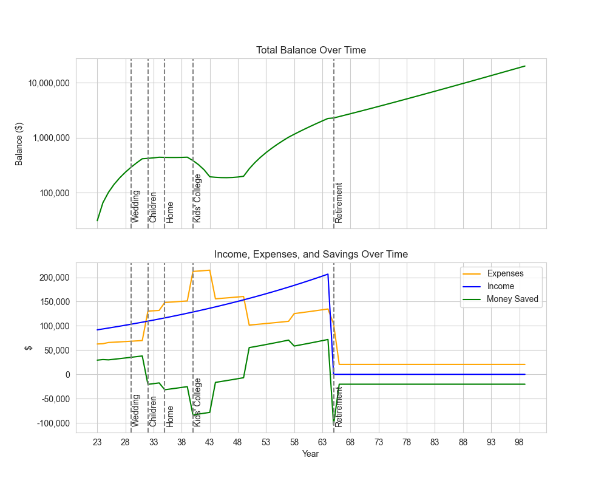

# Jacob's Lifelong Financial Planning

This script is designed to help plan long-term finances. By adjusting the parameters, you can see if you meet your financial goals.

## Example Results

## Overview

The script simulates your financial life from the year you start earning until the year you die. It takes into account your income, expenses, and financial goals such as buying an aircraft, wedding, children, home, retirement, and mom's yacht.

## Code Structure

1. **Define Constants**: Set your birth year, starting year, and death year. Also, set your starting income, year-over-year income growth, and year-over-year investment return.

2. **Define Financial Goals**: Set your financial goals along with the age you want to achieve them, their total value, down payment, monthly payment, and loan term.

3. **Define Monthly Expenses**: Define your monthly expenses at each stage of life. The current stages are defined as follows:
    - Stage 1: From the age of 22 until you purchase a house.
    - Stage 2: From house purchase until retirement.
    - Stage 3: From retirement until death.

4. **Run the Simulation**: Create an instance of the `Finance` class and call the `simulate_life` method.

## Dependencies

- seaborn
- matplotlib.pyplot

## Note

This is a simple script and does not take into account many factors that can influence your financial life. Always consult with a financial advisor for accurate financial planning.
